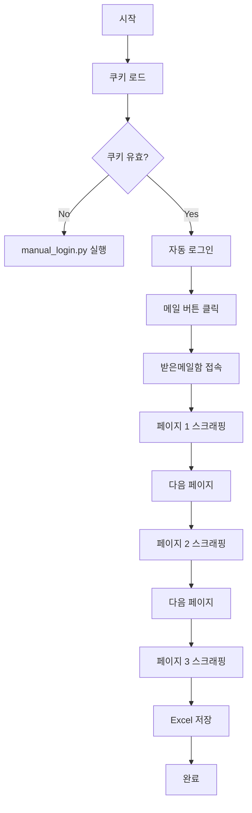

# Bizmeka 메일 스크래퍼 사용 가이드

## 🎯 목적
Bizmeka 웹메일에서 받은 메일함 데이터를 자동으로 수집하여 Excel 파일로 저장

## 📋 전제 조건
1. **쿠키 파일 필요**: `manual_login.py`로 먼저 로그인하여 쿠키 저장
2. **pandas 설치**: `pip install pandas openpyxl`

## 🚀 실행 방법

### 방법 1: 디버그 모드 (첫 실행 권장)
```bash
python mail_scraper_debug.py
```
또는
```bash
run_debug.bat
```

**디버그 모드 특징:**
- 브라우저가 보이는 상태로 실행 (headless=False)
- 단계별로 스크린샷 저장
- 페이지 구조 분석 정보 출력
- 수동으로 메일/받은메일함 버튼 클릭 가능

### 방법 2: 자동 실행
```bash
python mail_scraper.py
```
또는
```bash
run_mail_scraper.bat
```

**자동 실행 프롬프트:**
```
수집할 페이지 수를 입력하세요 (기본: 3): [Enter 또는 숫자 입력]
```

## 📊 출력 파일

### Excel 파일 위치
`data/bizmeka_mails_YYYYMMDD_HHMMSS.xlsx`

### Excel 파일 구조
| 페이지 | 보낸사람 | 제목 | 날짜 | 수집시간 |
|--------|----------|------|------|----------|
| 1 | 홍길동 | 회의 안내 | 2025-01-10 | 2025-01-10 14:30:00 |
| 1 | 김철수 | 프로젝트 진행사항 | 2025-01-10 | 2025-01-10 14:30:00 |
| 2 | 이영희 | 보고서 검토 요청 | 2025-01-09 | 2025-01-10 14:30:01 |

### 디버그 파일
- `data/debug/step1_main.png` - 메인 페이지
- `data/debug/step2_mail.png` - 메일 페이지
- `data/debug/step3_inbox.png` - 받은메일함
- `data/debug/inbox_page.html` - HTML 구조

## ⚠️ 문제 해결

### 메일 버튼을 찾을 수 없음
**증상**: "메일 버튼을 찾을 수 없습니다"
**해결**:
1. 디버그 모드로 실행
2. 수동으로 메일 버튼 클릭
3. 선택자 정보 확인 후 코드 수정

### 받은메일함 접속 실패
**증상**: "받은메일함 버튼 없음"
**해결**:
- 이미 받은메일함에 있을 수 있음 (정상)
- 디버그 모드로 구조 확인

### 데이터 수집 실패
**증상**: 0개 메일 수집
**해결**:
1. `inbox_page.html` 파일 확인
2. 테이블 구조 분석
3. 선택자 수정 필요

## 🔧 커스터마이징

### 수집 페이지 수 변경
```python
# mail_scraper.py 실행시
scraper.run(max_pages=5)  # 5페이지 수집
```

### 수집 필드 추가
```python
# mail_scraper.py의 scrape_mail_page 메서드 수정
# 예: 첨부파일 여부 추가
attachment = await row.query_selector('img[alt*="첨부"]')
has_attachment = '있음' if attachment else '없음'
```

### 선택자 수정
```python
# 메일 버튼 선택자 추가
mail_selectors = [
    'a[href*="mail"]',
    'button:has-text("메일")',
    # 새 선택자 추가
    'div.mail-button',  # 예시
]
```

## 📝 로그 확인
```bash
# 오늘 로그 보기
python utils.py --show-logs today
```

## 🔄 전체 프로세스



## 💡 팁

1. **첫 실행은 디버그 모드로**: 페이지 구조 파악
2. **3페이지로 테스트**: 전체 수집 전 작은 단위로 테스트
3. **정기 실행**: Windows 작업 스케줄러 등록 가능
4. **대량 수집시**: headless=True로 설정 (config.json)

## 🐛 디버깅 명령

```python
# Python 콘솔에서 직접 테스트
from mail_scraper import MailScraper
import asyncio

scraper = MailScraper()
asyncio.run(scraper.run(max_pages=1))
```

## 📞 지원
- 로그 파일: `data/logs/`
- 스크린샷: `data/debug/`
- HTML 구조: `data/debug/inbox_page.html`