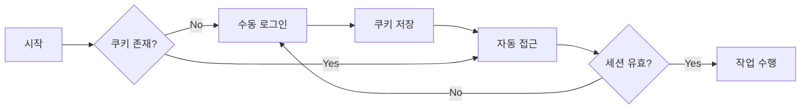

# Bizmeka 자동화 솔루션

## 📌 핵심 원리
**쿠키 기반 세션 재사용** - 한 번 수동 로그인 후 쿠키를 저장하여 2차 인증 없이 자동 접근

## 🚀 빠른 시작

### 1단계: 수동 로그인 (최초 1회)
```bash
python bizmeka_automation/manual_login.py
```
- 브라우저가 자동으로 열림
- 수동으로 로그인 + 2차 인증 완료
- 쿠키 자동 저장

### 2단계: 자동 접근 (반복 사용)
```bash
python bizmeka_automation/auto_access.py
```
- 저장된 쿠키로 자동 로그인
- 2차 인증 없이 접근

### 3단계: 메일 데이터 수집 (선택)
```bash
# 메일 스크래핑 (3페이지)
python bizmeka_automation/mail_scraper.py

# 디버그 모드 (구조 분석)
python bizmeka_automation/mail_scraper_debug.py
```
- 메일함 자동 접속
- 받은 메일 데이터를 Excel로 저장

## 📁 프로젝트 구조
```
bizmeka_automation/
├── README.md              # 이 문서
├── config.json           # 설정 파일
├── manual_login.py       # 수동 로그인 모듈
├── auto_access.py        # 자동 접근 모듈
├── cookie_manager.py     # 쿠키 관리 모듈
├── session_keeper.py     # 세션 유지 모듈
├── mail_scraper.py       # 메일 스크래핑 모듈
├── mail_scraper_debug.py # 메일 스크래핑 디버그
├── test_system.py        # 시스템 테스트
├── utils.py             # 유틸리티 함수
├── .env                 # 로그인 정보 (gitignore)
└── data/
    ├── cookies.json     # 저장된 쿠키
    ├── *.xlsx          # 수집된 메일 데이터
    └── logs/           # 로그 파일

browser_profiles/       # 브라우저 프로필 (별도 경로)
```

## 🔧 주요 기능

### 1. 수동 로그인 (`manual_login.py`)
- 브라우저 실행
- 로그인 페이지 자동 이동
- 쿠키 수집 및 저장

### 2. 자동 접근 (`auto_access.py`)
- 쿠키 로드
- 자동 로그인
- 작업 수행

### 3. 쿠키 관리 (`cookie_manager.py`)
- 쿠키 저장/로드
- 만료 시간 확인
- 쿠키 갱신

### 4. 세션 유지 (`session_keeper.py`)
- 주기적 세션 갱신
- 만료 전 알림
- 자동 재로그인

### 5. 메일 스크래핑 (`mail_scraper.py`)
- 자동 로그인 후 메일함 접속
- 받은 메일함 데이터 수집
- 페이지네이션 지원 (여러 페이지)
- Excel 파일로 자동 저장 (보낸사람, 제목, 날짜)

## ⚠️ 주의사항

### 실패 원인과 해결책

| 문제 | 원인 | 해결책 |
|------|------|--------|
| 2차 인증 계속 발생 | 자동화 도구 감지 | 쿠키 재사용 방식 사용 |
| 세션 만료 | 시간 경과 | `session_keeper.py` 실행 |
| PC 변경시 실패 | 기기별 쿠키 | 새 PC에서 수동 로그인 1회 |
| 접근 권한 오류 | 잘못된 URL | `config.json`의 URL 수정 |

## 🔄 자동화 프로세스



## 📝 설정 파일 (`config.json`)

```json
{
  "credentials": {
    "username": "kilmoon@mek-ics.com",
    "password": "moon7410!@"
  },
  "urls": {
    "login": "https://ezsso.bizmeka.com/loginForm.do",
    "main": "https://www.bizmeka.com/",
    "app": "https://www.bizmeka.com/app/main.do"
  },
  "paths": {
    "cookies": "data/cookies.json",
    "profile": "C:\\projects\\autoinput\\browser_profiles\\bizmeka",
    "logs": "data/logs"
  },
  "settings": {
    "headless": false,
    "timeout": 30000,
    "keep_alive_interval": 86400
  }
}
```

## 🛠️ 문제 해결 가이드

### Q: 2차 인증이 계속 나타납니다
A: 정상입니다. 최초 1회는 수동으로 2차 인증을 완료해야 합니다.

### Q: 쿠키가 만료되었습니다
A: `manual_login.py`를 다시 실행하여 새 쿠키를 저장하세요.

### Q: 다른 PC에서 사용하고 싶습니다
A: 새 PC에서 `manual_login.py`를 실행하세요.

### Q: 자동으로 세션을 유지하고 싶습니다
A: Windows 작업 스케줄러에 `session_keeper.py`를 등록하세요.

## 📊 로그 확인
```bash
# 오늘 로그 확인
python utils.py --show-logs today

# 쿠키 상태 확인
python cookie_manager.py --check-status
```

## 🔐 보안 주의
- `cookies.json` 파일은 민감한 정보입니다
- Git에 커밋하지 마세요 (`.gitignore`에 추가)
- 정기적으로 비밀번호를 변경하세요

## 📞 문제 발생시
1. `data/logs/` 폴더의 로그 확인
2. 쿠키 파일 삭제 후 재시도
3. 브라우저 캐시 삭제 후 재시도

## 🎯 다음 단계
- [ ] GUI 인터페이스 추가
- [ ] 다중 계정 지원
- [ ] 자동 작업 스케줄링
- [ ] 에러 자동 복구